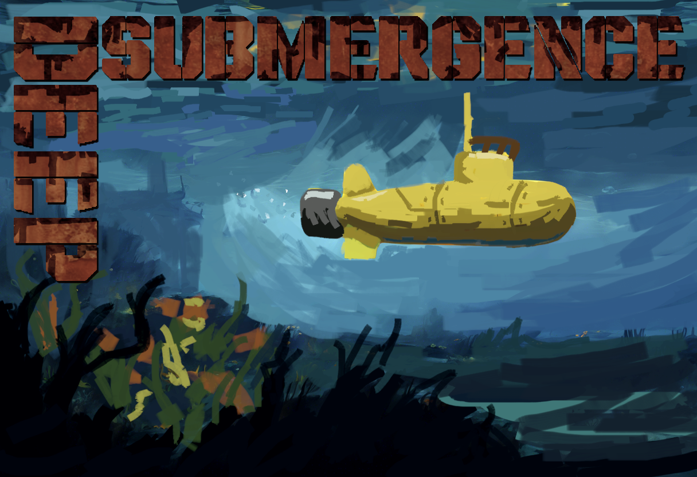

# Deep Submergence
Embark on a thrilling underwater adventure with this mod for Dredge! Take control of a submarine and plunge into the unknown, where uncharted depths hide strange and mysterious creatures waiting to be discovered. What secrets will you uncover in the deep?
Installable using the [Dredge Mod Manager](https://github.com/DREDGE-Mods/DredgeModManager).

This mod is a work in progress. Stay tuned for more improvements, features, and content, and report any problems as an issue in github.

# Feature List (Spoiler Free)
- Dive back into familiar waters as a Submarine
- 11 new types of creatures to find and capture
- Discoverable Deep Sea Base and accompanying storyline (Near Gale Cliffs!)
