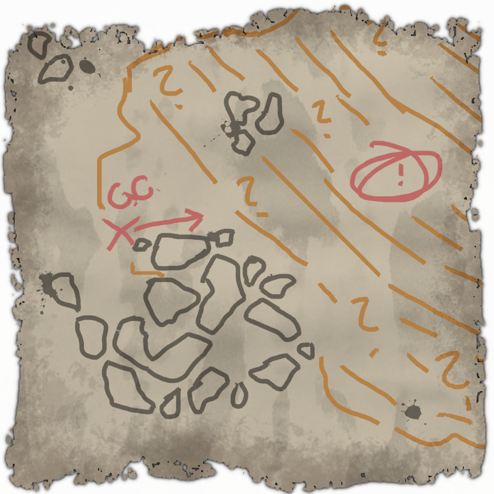

# Deep Submergence
Embark on a thrilling underwater adventure with this mod for Dredge! Take control of a submarine and plunge into the unknown, where uncharted depths hide strange and mysterious creatures waiting to be discovered. What secrets will you uncover in the deep?
Installable using the [Dredge Mod Manager](https://github.com/DREDGE-Mods/DredgeModManager).

This mod is a work in progress. Stay tuned for more improvements, features, and content, and report any problems as an issue in github. If you want to contribute to this project, please reach out on the [Dredge Mod Discord](https://discord.com/invite/qFqPuTUAmD)!

You can find the Fish and Sea Base by exploring around east of the Gale Cliffs. 

# Feature List (Spoiler Free)
- Dive back into familiar waters as a Submarine
- 11 new types of creatures to find and capture while diving
- Discoverable Deep Sea Base and accompanying storyline

# Known Issues
- Siphon Trawler doesn't function correctly.
- Sea Base and fish are difficult to find (See exclamation point on map above)
- Docking and quest dialogue have some small bugs with them
- References to "blueprints" are for upcoming items.
